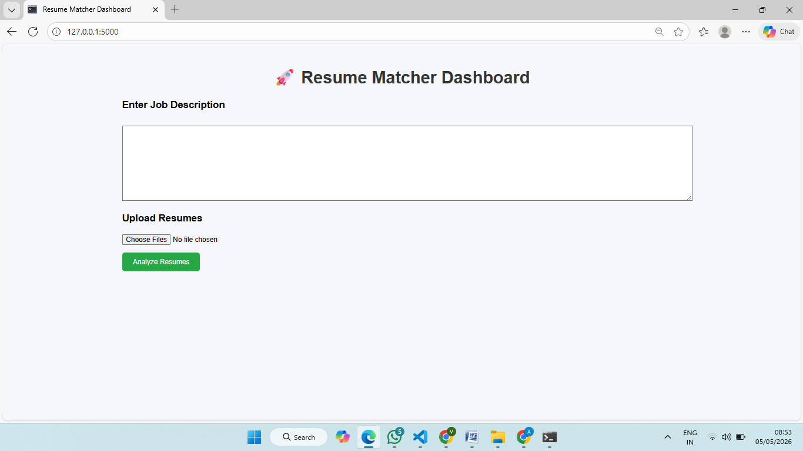
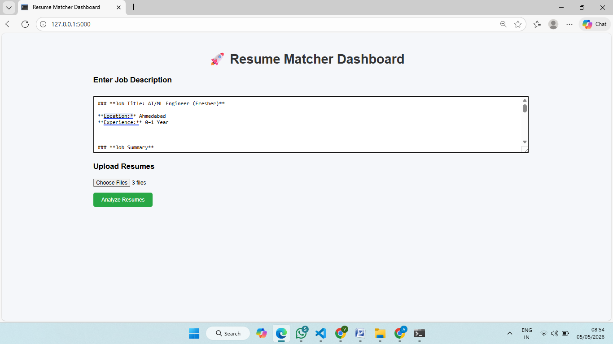
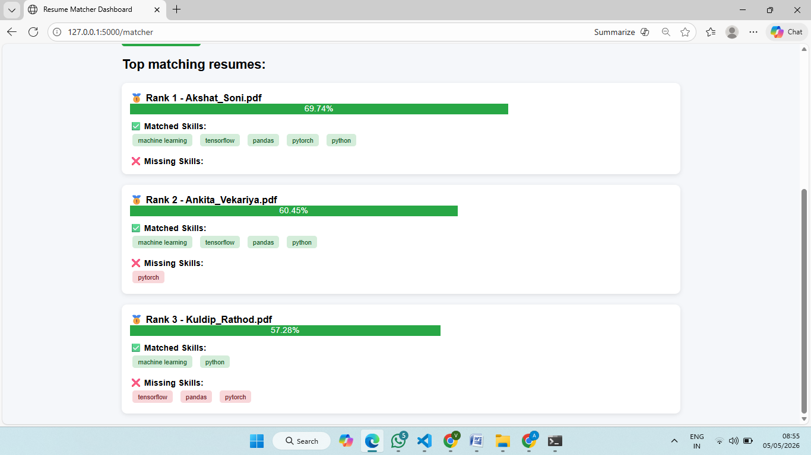

# 🚀 AI Resume Matcher

An AI-powered web application that matches resumes with job descriptions using NLP and semantic similarity.

---

## 📸 Screenshots

### 🏠 Home Page



### 📊 Results Dashboard


---

## 🔥 Features

* Upload multiple resumes (PDF, DOCX, TXT)
* Enter job description
* AI-based resume ranking
* Skill matching and missing skill detection
* Interactive dashboard with scores and insights

---

## 🧠 Tech Stack

* Python
* Flask
* Sentence Transformers (BERT)
* PyPDF2, docx2txt
* HTML, CSS

---

## ⚙️ How It Works

1. Extracts text from resumes
2. Cleans and preprocesses text
3. Converts text into embeddings using BERT
4. Calculates similarity between job description and resumes
5. Applies hybrid scoring (semantic + skill matching)
6. Displays ranked results with matched and missing skills

---

## 🛠️ Installation

```bash
git clone https://github.com/your-username/resume-matcher.git
cd resume-matcher

python -m venv venv
venv\Scripts\activate   # Windows

pip install -r requirements.txt
python main.py
```

---

## 🌐 Usage

Open in browser:

http://127.0.0.1:5000/

---

## 📌 Future Improvements

* Resume feedback suggestions
* Section-wise scoring (skills, experience)
* Deployment (Render / AWS)
* User authentication

---
